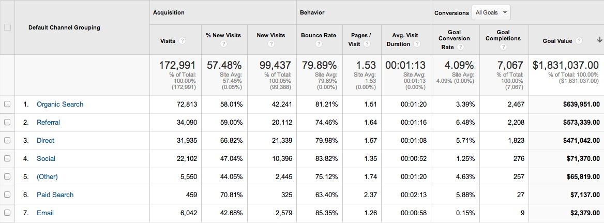
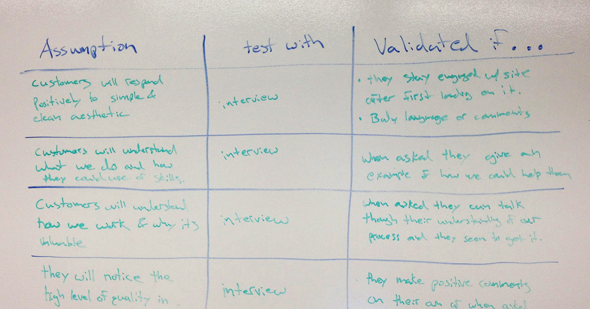
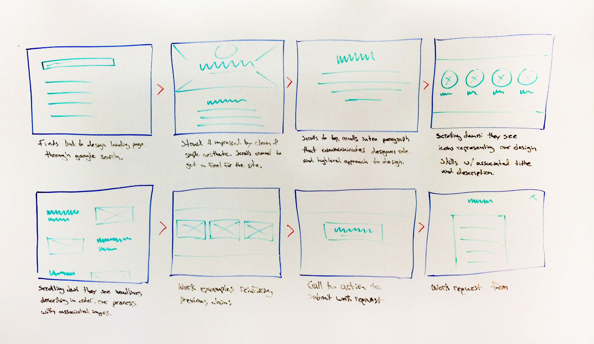

# Ürün Tasarım Süreci

Orjinali : [Thoughtbot Playbook](http://playbook.thoughtbot.com)

> "Çoğu insan tasarımın bir şeyin nasıl göründüğüne dair bir konu olduğu
> yanılgısına düşer. Onlara göre bu kadar basittir : tasarımcılara bir kutu
> verilir ve 'bunun güzel görünmesini sağla' denir. Konu sadece bir şeyin nasıl
> göründüğü veya hissettirdiği değildir. Tasarım bir şeyin nasıl çalıştığıdır."
> -Steve Jobs

[Ürün Tasarım Süreci](http://robots.thoughtbot.com/the-product-design-sprint)
[Google Ventures](http://gv.com/design)'un icat ettiği bir kavramdır ve [insanların istediği bir şeyi](http://paulgraham.com/good.html) ortaya çıkarmayı amaçlayan 5 aşamalık bir uygulamadır. Maliyetli bir geliştirme sürecine başlarken varsayımlar yerine doğrulanmış şeylere güvenmeyi yeğliyoruz. Veya, hiç işe yaramayacak bir ürünü inşa edip buna değmeyeceğini öğrenmektense kurşunlar gelirken eğilmeyi istiyoruz.

Süreçler bir ürün veya iş akışı ortaya çıkartırken iyi başlangıç noktalarıdır,
aynı zamanda var olan ürünlerle ilgili olarak mevcut sorunları çözerken de
faydalı araçlar oluştururlar. Genellikle 5 gün sürerler ama daha az zamanda da
tamamlanabilirler. Başlangıç olarak bir odanın içine olabildiğince paydaşı ve
uzmanlığı toplamaya çalışmanız beklenir.

Ürün Tasarım Süreçlerine test güdümlü tasarım olarak ta bakılabilir.

## Hazırlık Çalışmaları

Sürece başlamadan önce, müşterilerimiz ürünümüzü son test aşamasında deneyecek 5
gerçek kişiyi bulurlar. Sonuçta kullanıcılarını bizim tanıdığımızdan daha iyi
tanımaları beklenir.

Aynı zamanda aşağıdakiler gibi internet üzerindeki değişik kaynaklar üzerinden
bilgi toplarlar :

* [Quora](http://quora.com)
* [Google Analtyics](http://analytics.google.com)
* [Adwords Anahtar Kelime Planlayıcı](https://adwords.google.com/ko/KeywordPlanner/Home)

Aynı zamanda biz de bazı (ücretli) çalışmalar yapabiliriz.

* [Kullanıcı görüşmeleri](http://www.nngroup.com/articles/interviewing-users/) planlayabilir ve yapabiliriz.
* Kullanıcılara ilişkin, sonuçlarının ilk aşamada tartışılacağı bir [anket](http://www.google.com/insights/consumersurveys/use_cases) çalışması yapabiliriz.

Genellikle ilk gün haricinde yemek için durduğumuz bir aktiviteden söz
etmiyoruz, bunun yerine ayaküstü birşeyler atıştırıp kısa molalar sonrasında
devam ettiğimiz bir aktivite oluyor.

## Anla

Bu aşamadaki alıştırmalar bizim için kullanıcılarımızın hayatını (tüketici
yazılımları) veya işini (iş yazılımları) anlayıp empati kurmak için gerekli faaliyetlerdir.

Bu aşama boyunca insanlar çoğunlukla post-it benzeri şeylerin üzerine not alır,
ve bulundukları odanın duvarlarına yapıştırırlar.

Bu aşamaya sunum egzersizi ile başlarız. Burada müşteri, ürününü tıpkı bir
yatırımcıya anlatır gibi anlatır. Bu deney bizim kullanıcıyı tanımamıza,
sorunlarını ve bu sorunu çözmek için kullandıkları ürünleri anlamamıza yardımcı
olur. Aynı zamanda yazılımın hizmet edeceği alan ile ilgili kelime haznesini de
oluşturmaya başlar.

Daha sonra, o zamana kadar yukarıda sayılan kaynaklar üzerinden yapılmış
araştırmaları inceleriz. Bu araştırmalar bize kullanıcılarımızın
motivasyonlarını, pazarlama kanallarını ve hedef pazarların büyüklüğünü
anlamamız konusunda yardımcı olur.

Son olarak, tasarım sürecinin geri kalanının odaklanacağı şeyin eskizini
çıkartırız : yazılımın kritik yolu. Bu aşamada bunu olabildiğince konseptüel ve
detaylardan uzak tutmaya çalışırız. Kritik yolu ortaya çıkartırken
kullanılabilecek harika bir soru şudur :

>[Kullanıcı ürünü hangi işi yapmak için kiralıyor?](http://www.youtube.com/watch?v=f84LymEs67Y)

Kritik yolu aşamalar ilerledikçe gözden geçirerek geliştireceğiz.

## Dağıl

Bu bölümdeki egzersizler hayal gücümüzü, kullanıcının ihtiyacı olan potansiyel
çözümler için geniş biçimde kullanmamıza yardımcı olur.

Bu aşamadan önce, ekibin tümü odada dolaşarak duvarlardaki yapışkan notları
inceler, kritik yol ile karşılaştırır ve kritik yola eklenmesi gerektiği halde
eklenmeyen bir özellik olup olmadığına bakar.

Bu bölüme yine sunum çalışması ile başlar ve sunumda ifade edilenleri kritik yol
ile karşılaştırırız.

Daha sonra ekipteki herkesin 10 veya daha üzerinde [kullanıcı akışı]((https://signalvnoise.com/posts/1926-a-shorthand-for-designing-ui-flows) ve kullanıcı arayüzü çizmelerini istiyoruz. İnsanlara kullanıcıların uygulamaya gelecekleri kaynakları da dahil etmelerini söylüyoruz: Twitter? Blog gönderisi? Adwords? Otomatik öneriler? Email? Bir arkadaşın tavsiyesi? Anlık bildirim?

Eğer ürün gerçekleşirse, bu kaynaklar sonunda [Google Analytics içinde bulunan
"Edinme Kanalları"](http://analytics.blogspot.com/2013/10/new-acquisitions-reporting-channels.html) raporunda ölçümlenecek.

Dhaa sonra bu eskizleri bir duvara koyuyor ve sessiz bir kritik seansına
girişiyoruz, gözlem yaparak ve sevdiğimiz arayüzlerin üzerine yapışkanlı işaretler koyarak ilerliyoruz. Herhangi bir fikri yargılamıyor veya yüceltmiyoruz. Bu oylama
süreci uzun tartışmaları ve komite tarafından tasarımı önlüyor.

Son olarak, daha büyük yapışkanlı işaretler koyarak bir "süper oylama"
yapıyoruz. CEO veya ürünün sahibi her kimse o, en iyi fikirlerin üzerine büyük
bir "süper oy" yapıştırıyor. Bu bize müşteri organizasyonunun nasıl düşündüğünü
anlama ve otoritelerini pekiştirme şansı veriyor.

Bizim deneyimimize göre bu aşama gerçekten zihinsel olarak çok yıpratıcı.
Önerimiz bu aşamadan sonra daha fazla devam etmeyip erken bitirmeniz ve ekibi
yeniden şarj olmaları için eve göndermeniz.

## Toplan

Bu bölümdeki egzersizler bize yeni çözümler üretmeyi durdurmakta ve mevcut
çözümler arasında en iyi olanlara odaklanmakta, aynı zamanda da prototip için
testleri yazmakta yardımcı oluyor.

Öncelikle, en iyi tasarım fikirleri içinde varolan varsayımları tanımlıyoruz.
Kullanıcıların motivasyonlarıyla, iş modeliyle, kullanıcıları edinebilme
kabiliyetimizle ve bütçe içinde çözümü uygulayabilme kabiliyetimizle ilgili tüm
varsayımları tanımlıyoruz. Bunun bazı seçenekleri elememiz konusunda yardımı
dokunuyor.

Daha sonra geriye kalan notlar, kullanıcı akışları ve arayüzler arasında bırakmış olabileceğimiz çelişkilere göz atıyoruz: aynı sorunu farklı şekillerde çözmeye çalışan fikirler. Hemen uygulamaya geçirilemeyecek çözümleri eliyoruz.

Daha sonra, tek bir prototip mi (en iyi atış) çoklu alternatifler mi (kraliyet savaşı) kararını vereceğimiz aşama geliyor. Birden fazla prototip daha fazla giriş seviyesinde iş anlamına geliyor ama aynı zamanda daha fazla çıkmaz sokağı keşfetmemizi sağlayabilir. Bu da sonraki tasarım süreçlerinde kurşunlardan korunmamızı sağlayacaktır.

Daha sonra, kaç tane üretmeye karar verdiysek tüm prototipleri storyboard haline getiriyoruz. Storyboard, kullanıcımızın uygulama üzerinde gerçekleştirdiği akışların karikatürize bir halidir.

Son olarak test senaryosunu Google Docs üzerinde oluşturuyoruz ve gözlem odasını
n duvarına bir skorboard asıyoruz. Script daha önce oluşturulan storyboard'a
dayanıyor ve skorbordu da testin sonuçlarını kaydetmek için kullanacağız. Bu
bize öğrenmeye çalıştığımız şey konusunda olabildiğince berrak olmamız konusunda
yardımcı olacak.

## Prototiple

Askerleri toplamak için yeni bir sunumdan sonra, artık içinde herhangi bir
egzersiz olmayan bölüme geliyoruz. Bu aşama tümüyle doğru prototipleri üretmek
üzerine kurulu. Prototipler yeterli seviyede orjinal fikre sadık olmalı ki,
doğru kullanıcı test sonuçları üretilebilsin.

Tüm aşama boyunca, müşterilerimizden Google Docs üzerine sitede kullanılacak
metinleri yazmalarını istiyoruz. [Gerçek metin](http://gettingreal.37signals.com/ch11_Use_Real_Words.php) kullanıyorlar, lorem ipsum değil. Kullanıcının mesajı anlayıp anlamadığını ve heyecanını test etmenin yolu bu. Bu metinler daha sonra tweet, basın vs için de yararlı oluyor.

Müşterilerimiz sitenin iletişimini cilalarken biz de prototiplemeye
odaklanıyoruz. Tasarımcı ve projeye bağlı olarak farklı araçlar kullanıyoruz.

Web uygulaması prototipleri için, bazı iyi seçenekler :

*   [Squarespace](http://www.squarespace.com) temaları
*   [Bourbon](http://bourbon.io) + [Neat](http://neat.bourbon.io) +
[Bitters](http://bitters.bourbon.io) lokalde geliştirme
*   [Invision](http://www.invisionapp.com)

Mobil Uygulama prototipleri için, bazı iyi seçenekler :

*   [Flinto](https://www.flinto.com) +
[Sketch](https://itunes.apple.com/us/app/sketch/id402476602?mt=12)
*   [Prototyping on Paper](https://popapp.in/)

Bu ürünleri tasarım sürecinde öğrenmeye uğraşmayın. Onlarla boş zamanınızda
tanışın ve süreç sırasında gerçekten üzerinde ustalaştığınızı kullanın.

## Test Et ve Öğren

Son olarak, 5 kullanıcı ile  onları anlayıp anlamadığımızı, onların bağlamını ve
kendi prototipimizi doğru eşleştirip eşleştirmediğimizi anlamak için
söyleşiyoruz. Bu bir kullanım testi değil. Onlarla konuşmaya henüz prototipi
göstermeden başlıyoruz.

Tasarımcılarımızdan biri her bir kullanıcı ile görüşüyor. Onları bir görüşme
odasında, video ve ses kaydı çalışırken bir araya getiriyoruz ve diğer proje
paydaşları görüşmeyi izlerken tartışıp sonuçları skorborda kaydediyorlar.

İyi sorular, genellikle açık uçlu olarak kullanıcının hikaye anlatmasını
isteyenlerdir:

> "Bize bir sivil toplum kuruluşuna bağış yaptığınız zamandan bahseder
> misiniz?"

Kullanıcıları beklenen bir yanıta yönlendirmeyin.

> "eğer imkanınız olsa bir kamu okuluna bağış yapar mıydınız?"

Diyalogu kapatmayın. 

> "Geçtiğimiz hafta içinde bir kuruma bağış yaptınız mı?"

Yeni bir ürün için, herhangi bir ekibin ilk tasarım sürecin sonunda doğru çözümü
bulması olası değildir. En muhtemel olasılık, müteakip bir tasarım süreci daha
başlatıp, Dağıl veya Toplan aşamasından başlayarak yeni kullanıcılarla test
etmektir.

Bir veya iki süreç sonunda, genellikle pek çok varsayımımızı doğrulamış, berrak
bir kritik yolu ortaya çıkartmış ve daha geniş bir kitleye ulaşmak için ilk
versiyonu kodlamaya başlamış oluruz.

Web uygulamaları çin genelllikle ilk versiyonu 4-6 hafta arasında yayınlarız.
Mobil uygulamalar için ilk betayı 6-8 hafta içinde [HockeyApp](http://hockeyapp.net) ile yayınlar ve 8-10 hafta içinde App Store'a koymuş oluruz.

Bu zaman dilimleri göz önüna alınırsa, 2 ila 5 gün sürecek ikinci hatta üçüncü
bir tasarım sürecini organize etmek geri dönüşe değerdir. Aksi taktirde, projeye
harcanan zaman ve paranın 4 ila 10 katını harcayabilirsiniz.

Tasarım sürecinin bir başka çıktısı, çözülmemiş müşteri derdi, bulanık
bırakılmış bir iş modeli veya olumlu ya da olumsuz olarak test edilmemiş
varsayım bırakmamasıdır. Doğru bildiğiniz şeylerde yanılmak duygusal olarak zor
olsa da, başarıdır. Size zaman ve para kazandırır.

Bu aşamayı da ileriye dönük bir planla kapattıktan sonra tasarım sürecini
tamamlıyoruz.
